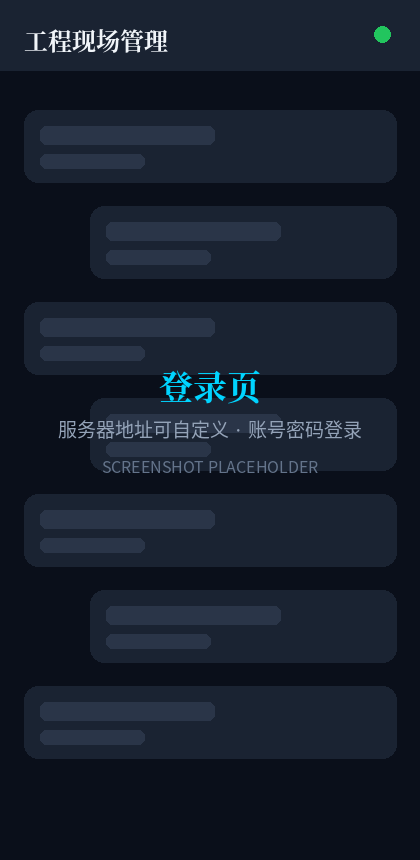
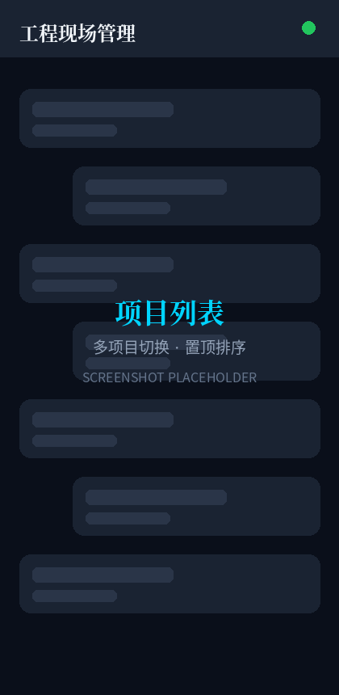
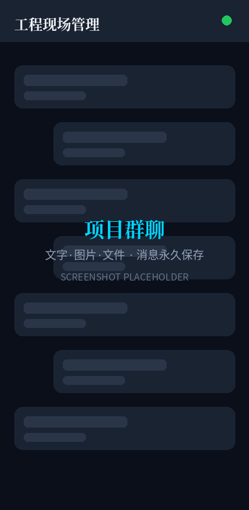
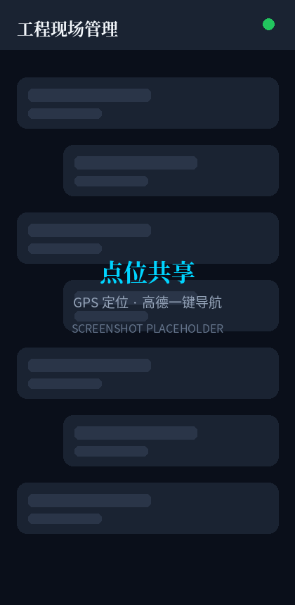
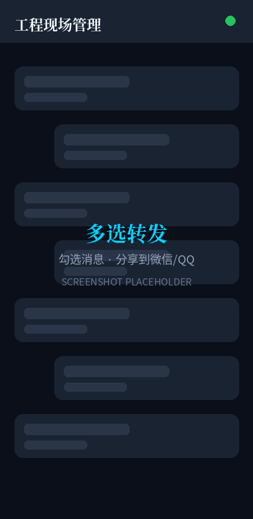

<div align="center">

# 🏗️ 工程现场施工管理系统 · Flutter App

### 施工日志填报 + 现场水印照片 + 项目群聊，配合自部署后端使用


</div>

---

> 本仓库是**移动端 App**。后端服务（API + WebSocket + 网页管理后台 + 数据库）请见
> **[construction-backend](https://github.com/qianqianjie-999/construction-backend)**，
> 部署指南见后端仓库 [docs/DEPLOY.md](https://github.com/qianqianjie-999/construction-backend/blob/main/docs/DEPLOY.md)。

## 📸 界面预览

<div align="center">

    

登录（服务器地址可自定义）｜ 项目列表 ｜ 施工日志 ｜ 水印照片填报 ｜ 项目群聊

 

点位共享·高德导航 ｜ 多选消息转发微信/QQ

</div>

## ⭐ 核心功能

- **📋 施工日志填报**：天气气温、出勤人数、机械台班、施工内容、质量安全情况；支持新建/编辑
- **📷 现场照片水印**：拍照/相册多选，自动叠加项目名、日期时间、GPS 地址与经纬度水印，杜绝伪造
- **💬 项目群聊**：文字 / 图片 / 文件 / GPS 点位；WebSocket 实时推送、已读回执、消息撤回、聊天记录搜索；**消息永久保存在服务器**，换机不丢
- **📍 点位共享**：发送当前位置，对方一键拉起高德地图查看/导航
- **📤 转发微信/QQ**：长按消息进入多选，文字/点位/图片/文件混合转发给外部协作方
- **🔒 连自己的服务器**：登录页即可填写服务器地址，一套 App 可连接任意自建后端；支持自签名 HTTPS 证书
- **🌐 弱网友好**：断线自动重连，上传状态可见

## 🧱 技术栈

| 能力 | 技术 |
| --- | --- |
| 框架 | Flutter 3 / Dart 3（Android 为主，可扩展 iOS） |
| 网络请求 | dio（全局登录 Authorization 头、自签证书信任） |
| 实时通信 | socket_io_client（强制 WebSocket 传输） |
| 图片 | image_picker + image（水印、压缩） |
| 分享 | share_plus（系统分享面板：微信/QQ 等） |
| 本地存储 | shared_preferences（登录态、服务器地址记忆） |

## 🚀 快速开始

```bash
flutter pub get

# 调试运行（USB 连真机）
flutter run

# 打包 Release APK
flutter build apk --release
# 产物：build/app/outputs/flutter-apk/app-release.apk
```

**指定后端地址**（三选一，优先级从高到低）：

1. App 登录页"服务器地址"输入框填写（运行时可随时切换）
2. 打包时注入：
   ```bash
   flutter build apk --release --dart-define=API_BASE_URL=https://你的服务器IP:9304
   ```
3. 不改则用代码中的占位默认值（首次使用必须在登录页填写）

## 📂 目录结构

```
lib/
├── main.dart                # 入口 + 全局深色主题 + HttpOverrides
├── models/                  # 数据模型（项目、日志、聊天消息）
├── screens/                 # 页面（登录、项目、日志表单、聊天）
├── services/                # api / auth / socket / chat / 水印 服务
└── widgets/                 # 消息气泡、图片选择器等通用组件
```

## 🔌 对接说明（后端开发者）

```
HTTPS 请求  →  dio → 后端 REST API（Bearer token 鉴权）
WSS 长连接  →  Socket.IO（transports: ['websocket']，握手带 Authorization 头）
```

- Nginx 反代必须配置 `Upgrade` / `Connection` 头并放大读超时（WebSocket 长连接），模板见后端仓库 `deploy/nginx.conf`
- App 信任用户自签证书，内网/IP 直连 HTTPS 可用；纯内网 HTTP 也可

## 🐛 常见踩坑

| 现象 | 根因 | 处理 |
|---|---|---|
| `connectionError` 连不上 | AndroidManifest 缺 `INTERNET` 权限 | 已在清单中声明，自建工程勿漏 |
| Socket.IO 握手失败 | Android 仅支持 WebSocket 传输 | `setTransports(['websocket'])` + `enableForceNewConnection()` |
| 照片上传类型错误 | image_picker 1.0+ 返回 XFile 而非 File | 统一 `XFile.readAsBytes()` + `MultipartFile.fromBytes()` |
| 自签名 HTTPS 报错 | Dart 默认不信任自签证书 | 全局 `HttpOverrides` + `network_security_config.xml` |

## 🤝 贡献

欢迎 Issue / PR，提交信息建议中文（`feat:` / `fix:` / `docs:`）。后端接口变更请两个仓库同步。

## 📄 License

MIT
